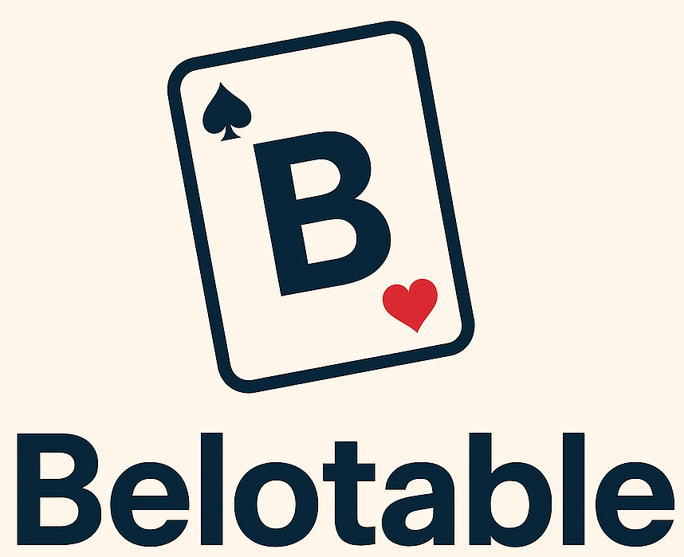

# Belotable

Belotable est un outil pour organisation et scoring d'un concours de belote.

Il fonctionne sans connexion internet.

Il s'adresse aux associations ou organisateurs de concours de belote.

## Téléchargement

Chaque release met à disposition les éléments nécessaires pour installer Belotable sur le système souhaité (exe pour Windows, image docker sinon) et sa documentation utilisateur sous forme de pdf.

- version stable la plus récente : https://github.com/estelle-bissay-viseo/belotable/releases/latest
- version en cours de développement (susceptible de contenir des bugs) : https://github.com/estelle-bissay-viseo/belotable/releases/tag/dev-latest

## Documentation utilisateur

La documentation utilisateur de la version stable la plus récente est disponible en ligne sur https://estelle-bissay-viseo.github.io/belotable/
