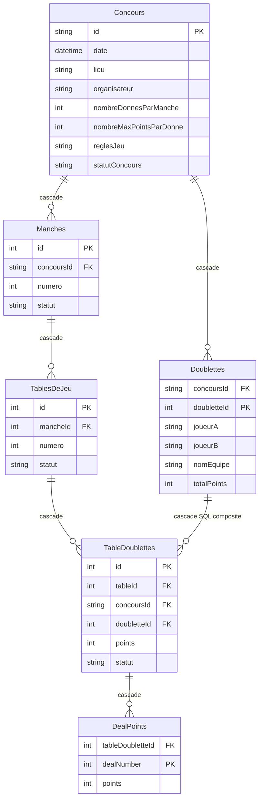

<!-- tags: architecture, database, développement -->
# Référence: Modèle de données en base de données

## Principe

L'objet principal est `Concours`. Tous les autres objets liés doivent être supprimés en cascade avec le concours.

## Schéma

## Validation

Il y a des tests pour valider les suppressions en cascade dans `belotable\test\data\repositories\cascade_delete_test.dart`.