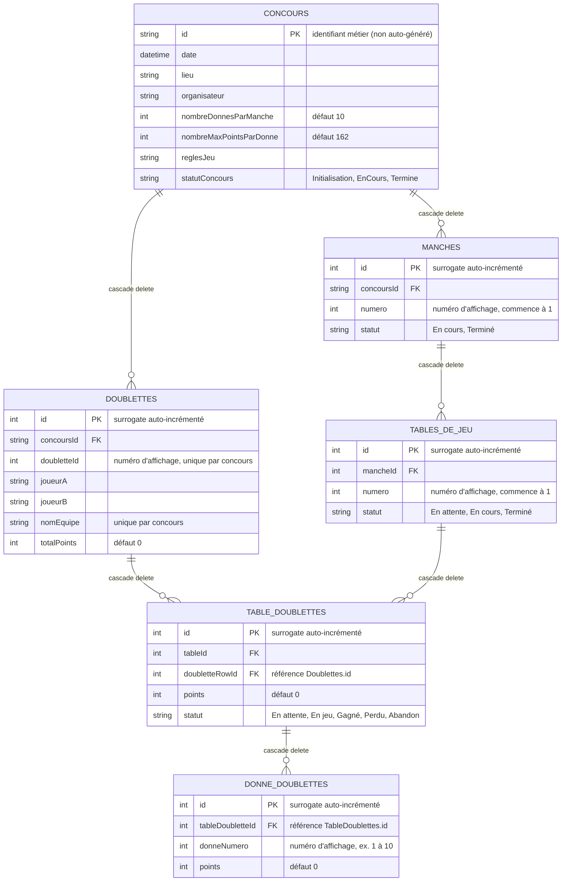

<!-- tags: database, architecture -->
# Référence: Modèle de données

## Aperçu

La base de données Belotable (SQLite via Drift, voir [drift-structure.md](drift-structure.md)) compte 6 tables réparties en 3 niveaux : le concours (racine), son inscription de doublettes, et le déroulé des manches (manches → tables de jeu → participations → donnes). Toutes les tables utilisent une clé primaire unique auto-générée, et les suppressions se propagent en cascade depuis `ConcoursTable` jusqu'aux `DonneDoublettesTable`.

## Diagramme entité-relation complet

## Détail des tables

### `ConcoursTable`

| Colonne | Type | Notes |
|---|---|---|
| `id` | `text` | Clé primaire, identifiant métier (pas de surrogate id ici, voir stratégie de clés). |
| `date` | `datetime` | Date du concours. |
| `lieu` | `text` | Lieu du concours. |
| `organisateur` | `text` | Entité organisatrice. |
| `nombreDonnesParManche` | `int` | Défaut 10. |
| `nombreMaxPointsParDonne` | `int` | Défaut 162. |
| `reglesJeu` | `text` | Texte libre des règles. |
| `statutConcours` | `text` | Défaut `initialisation`. |

### `DoublettesTable`

| Colonne | Type | Notes |
|---|---|---|
| `id` | `int` | Clé primaire auto-incrémentée. |
| `concoursId` | `text` (FK) | Référence `ConcoursTable.id`, cascade delete. |
| `doubletteId` | `int` | Numéro d'inscription affiché aux utilisateurs, unique par `concoursId` (contrainte `uniqueKeys`). Pas une clé. |
| `joueurA` / `joueurB` | `text` | Noms des deux joueurs. |
| `nomEquipe` | `text` | Unique par `concoursId` (contrainte `uniqueKeys`). |
| `totalPoints` | `int` | Cumul des points sur toutes les manches, défaut 0. |

### `ManchesTable`

| Colonne | Type | Notes |
|---|---|---|
| `id` | `int` | Clé primaire auto-incrémentée. |
| `concoursId` | `text` (FK) | Référence `ConcoursTable.id`, cascade delete. |
| `numero` | `int` | Numéro d'affichage de la manche, commence à 1. |
| `statut` | `text` | Défaut `En cours`. |

### `TablesDeJeuTable`

| Colonne | Type | Notes |
|---|---|---|
| `id` | `int` | Clé primaire auto-incrémentée. |
| `mancheId` | `int` (FK) | Référence `ManchesTable.id`, cascade delete. |
| `numero` | `int` | Numéro d'affichage de la table, commence à 1. |
| `statut` | `text` | Défaut `En attente`. |

### `TableDoublettesTable`

| Colonne | Type | Notes |
|---|---|---|
| `id` | `int` | Clé primaire auto-incrémentée. |
| `tableId` | `int` (FK) | Référence `TablesDeJeuTable.id`, cascade delete. |
| `doubletteRowId` | `int` (FK) | Référence `DoublettesTable.id`, cascade delete. |
| `points` | `int` | Score de la doublette à cette table, défaut 0. |
| `statut` | `text` | Défaut `En attente`. |

Contrainte d'unicité : `{tableId, doubletteRowId}` (une doublette ne peut apparaître qu'une fois par table).

### `DonneDoublettesTable`

| Colonne | Type | Notes |
|---|---|---|
| `id` | `int` | Clé primaire auto-incrémentée. |
| `tableDoubletteId` | `int` (FK) | Référence `TableDoublettesTable.id`, cascade delete. |
| `donneNumero` | `int` | Numéro d'affichage de la donne dans la table (1 à `nombreDonnesParManche`). |
| `points` | `int` | Points marqués sur cette donne, défaut 0. |

Contrainte d'unicité : `{tableDoubletteId, donneNumero}`.

## Stratégie de clé primaire

Depuis le refactoring du modèle de données, chaque table applique une règle unique et cohérente :

- **Une seule clé primaire auto-générée par table.** Toutes les tables sauf `ConcoursTable` utilisent un `id` entier auto-incrémenté (`integer().autoIncrement()`) comme unique clé primaire. Aucune table n'utilise de clé composite ou de clé fonctionnelle comme clé primaire.
- **Exception `ConcoursTable`** : son `id` reste une chaîne métier fournie à la création (pas de surrogate), car c'est la racine identifiée par l'utilisateur (ex. affichage dans les listes, navigation). Elle ne sert de FK à aucune autre table sous forme composite.
- **Champs métier/d'affichage séparés de la clé.** Les numéros visibles par les utilisateurs (`doubletteId`, `numero` de manche/table, `donneNumero`) sont des colonnes ordinaires, jamais des clés primaires. Leur unicité, quand elle est requise, est garantie par des contraintes `uniqueKeys` scopées (ex. `{concoursId, doubletteId}`), pas par la clé primaire.
- **Toutes les relations passent par l'`id` surrogate.** Chaque clé étrangère référence l'`id` auto-généré de la table parente (`doubletteRowId → Doublettes.id`, `tableDoubletteId → TableDoublettes.id`, etc.), jamais une combinaison de colonnes métier.
- **Cascade delete de bout en bout.** Chaque FK est déclarée avec `onDelete: KeyAction.cascade`, et `PRAGMA foreign_keys = ON` est activé à l'ouverture de la base (`AppDatabase.migration.beforeOpen`). Supprimer un `Concours` supprime donc automatiquement, en cascade, ses `Doublettes`, `Manches`, `TablesDeJeu`, `TableDoublettes` et `DonneDoublettes`.

## Sources (dépôt)

- `belotable/lib/data/database/app_database.dart`
