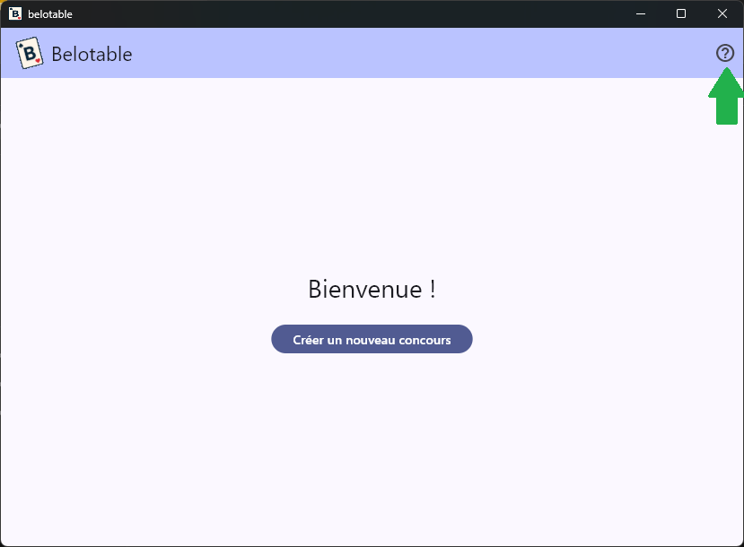
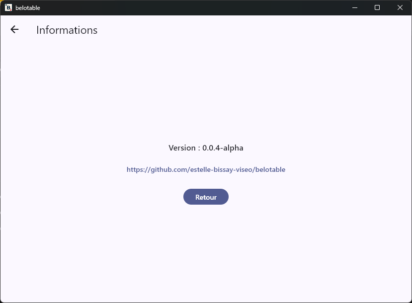

# Annexes

## Page d'informations

Depuis la page d'accueil, cliquez sur le bouton d'information (icône "?" à droite dans la barre supérieure) pour accéder à la page d'informations de l'application.

La page d'informations indique la version de l'application que vous utilisez, ainsi qu'un lien vers la page GitHub du projet pour signaler un bug, demander une nouvelle fonctionnalité ou télécharger la dernière version.

