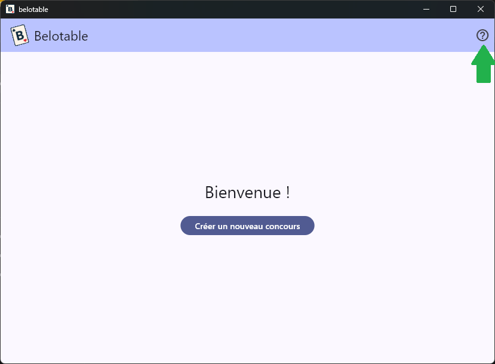
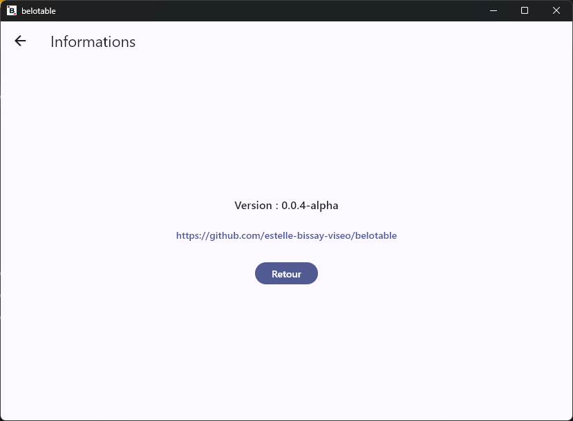

# Annexes

## Page d'informations

Depuis la page d'accueil, cliquez sur le bouton d'information (icône "?" à droite dans la barre supérieure) pour accéder à la page d'informations de l'application.

La page d'informations indique la version de l'application que vous utilisez, ainsi qu'un lien vers la page GitHub du projet pour signaler un bug, demander une nouvelle fonctionnalité ou télécharger la dernière version.

## Réinitialisation de la base de données

Dans le cas des montées de version de l'application qui modifient le schéma de la base de données, les migrations de ce schéma ne sont PAS prévues tant que l'application est en version bêta (version 0.x.x). L'application pourra démarrer mais des messages d'erreur peuvent survenir si le schéma de la base de données n'est pas à jour.

Il est donc nécessaire de remettre la base de données à zéro pour éviter les conflits de schéma et les erreurs d'exécution.

Attention, cette opération supprimera toutes les données de la base de données. Assurez-vous d'avoir gérer tous vos concours avant de procéder. Si vous souhaitez utiliser vos données sans les supprimer, vous devez télécharger/utiliser la précédente version de l'application avant de continuer à utiliser vos données.

### Application Windows

Sous Windows, la base de données est stockée sur votre disque local.

1. Fermer l'application si elle est en cours d'exécution.
2. Supprimer le fichier de base de données sqlite locale (situé dans C:\Users\VotreUtilisateur\AppData\Roaming\belotable\belotable).
3. Redémarrer l'application, qui recréera automatiquement la base de données avec le schéma actuel.

### Application web

Avec l'application web, la base de données est stockée parmi les données du navigateur (cookies, stockage local, IndexedDB, etc.).

1. Démarrer le serveur web de l'application.
2. Ouvrir l'application via votre navigateur.
3. Supprimer les cookies et données liés à l'adresse de l'application via votre navigateur.
4. Rafraichir la page de l'application dans votre navigateur.
