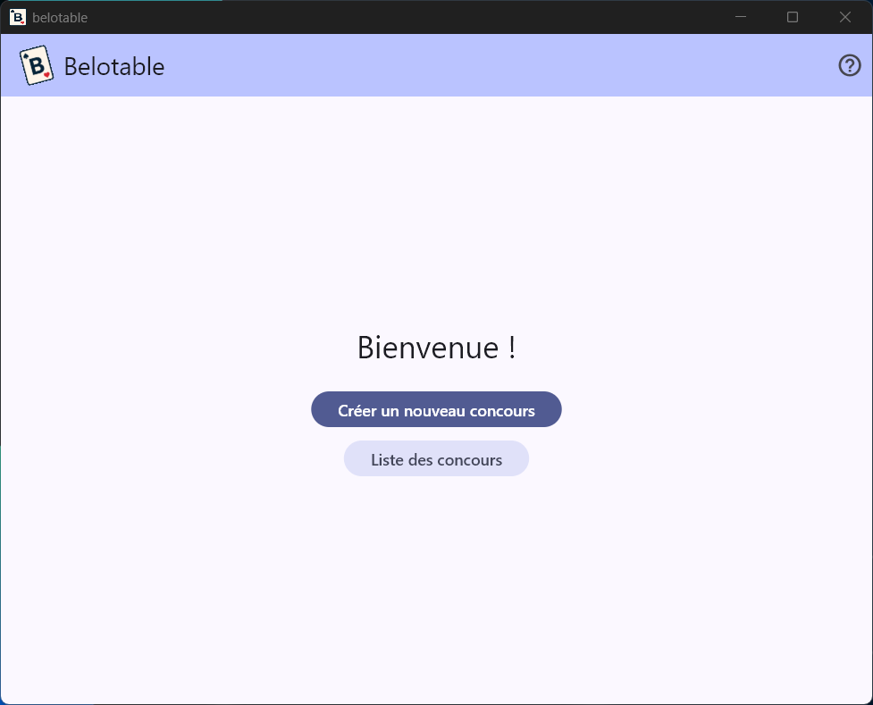
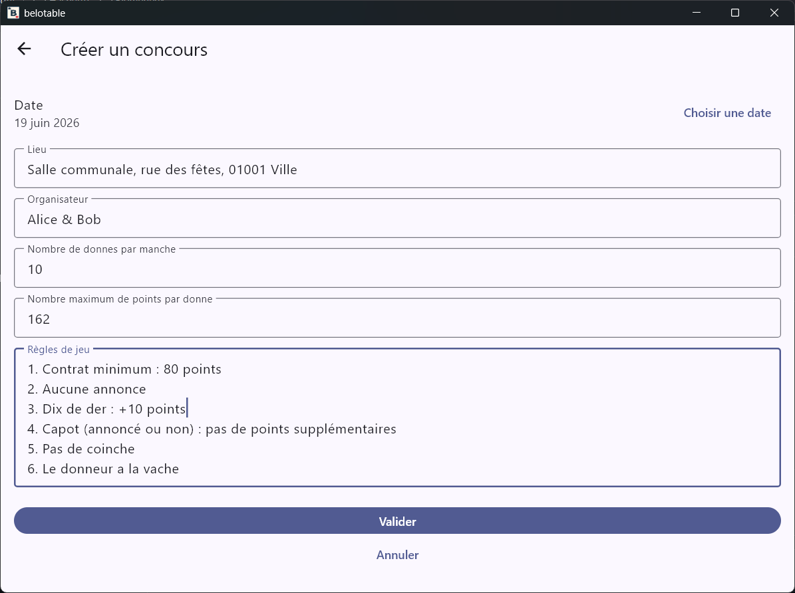
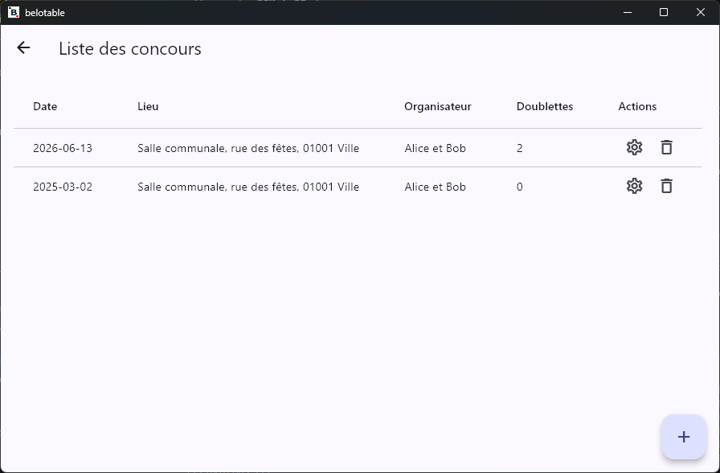
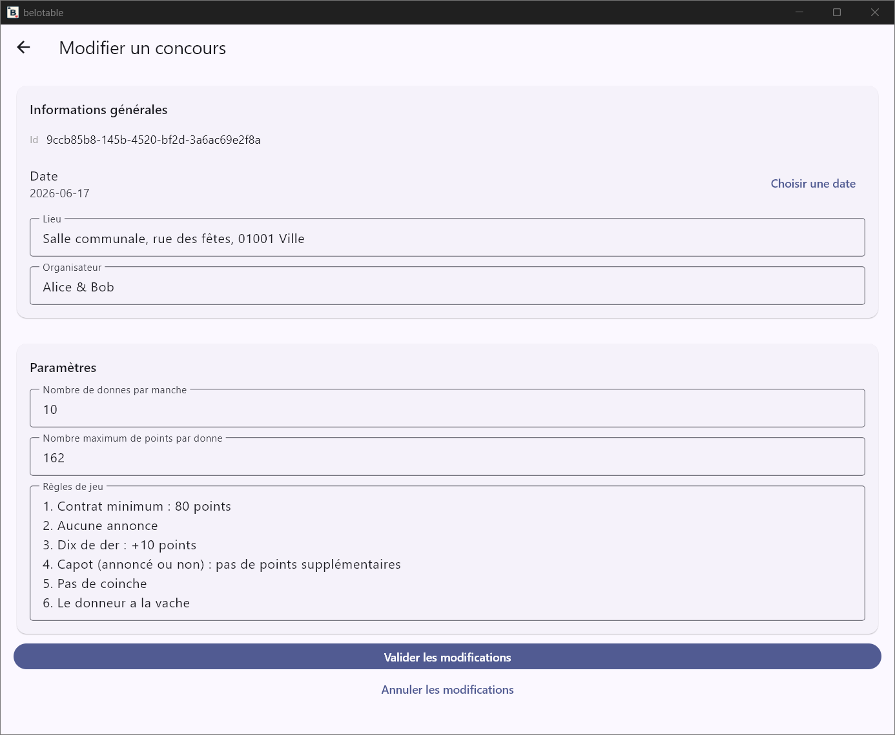
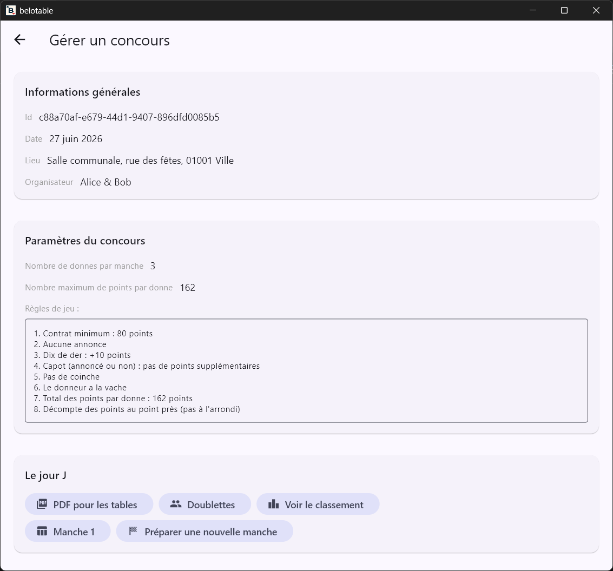
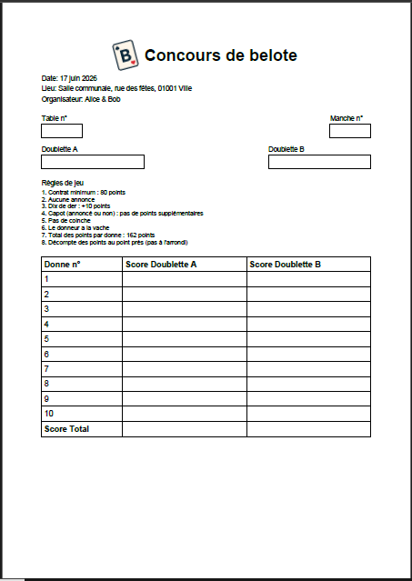
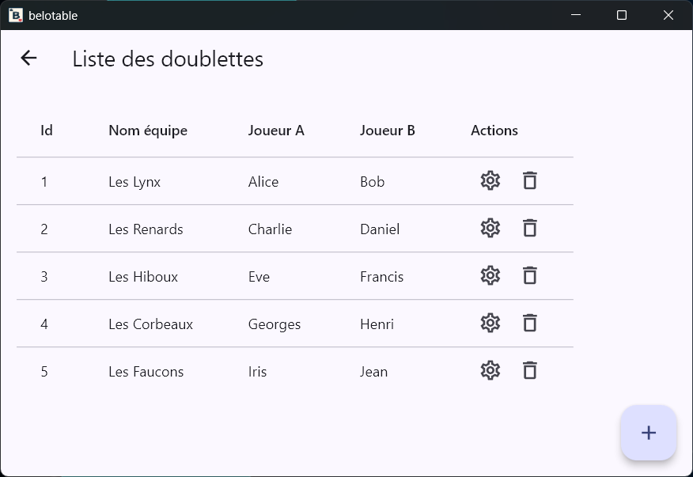
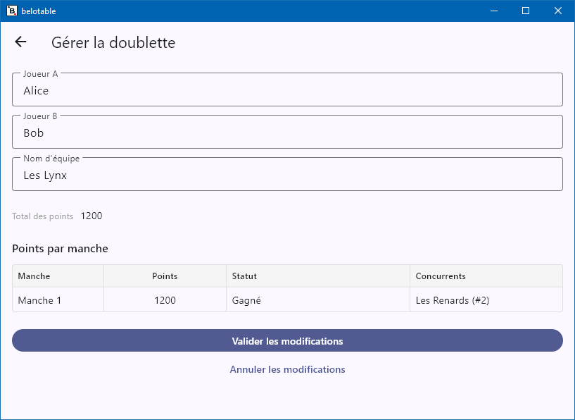
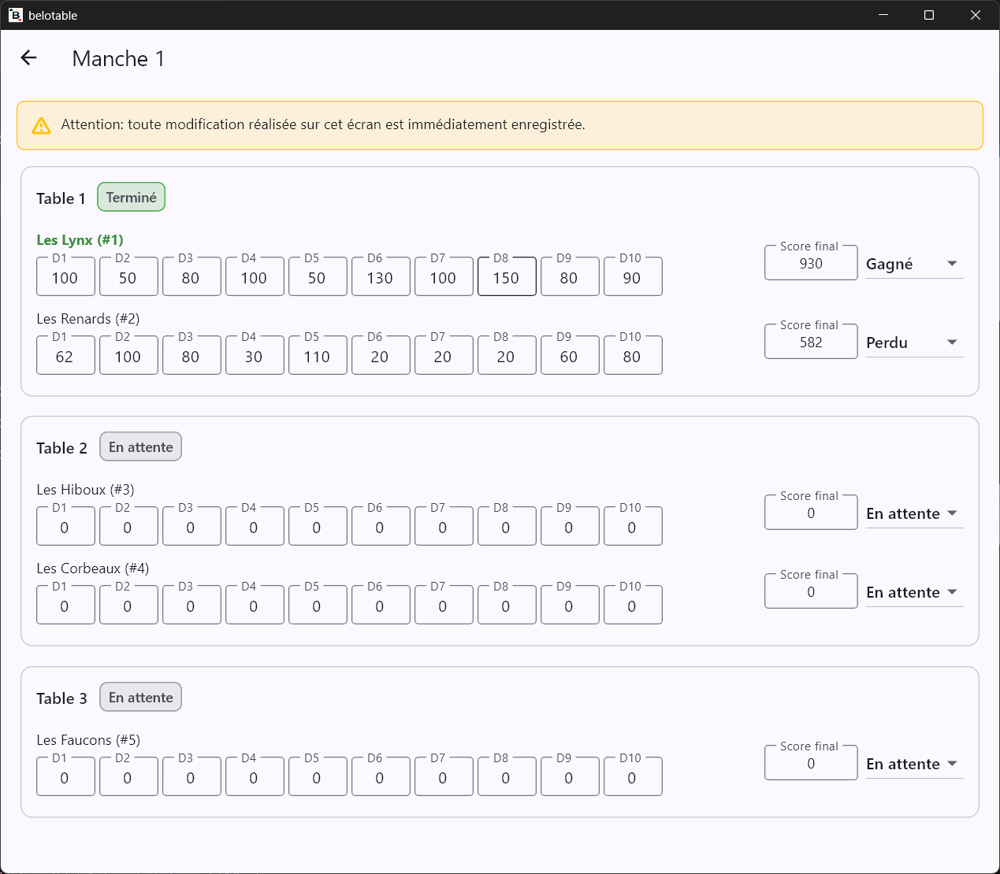
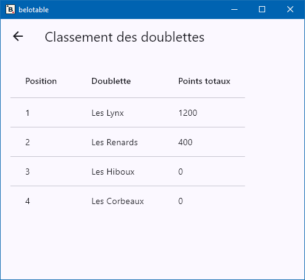

# Utilisation

## Page d'accueil

La page d'accueil est votre point d'entrée après le lancement de l'application.

## Création d'un concours

Depuis la page d'accueil, cliquez sur **Créer un nouveau concours**.

L'écran *Créer un concours* vous permet de renseigner les informations minimales du concours.

Les informations obligatoires sont :

- La **Date** du concours
- Le **Lieu** du concours (de préférence une adresse postale complète)
- L'**Organisateur** du concours (le nom de la personne ou de l'entité responsable)

Certaines informations sont pré-remplies par défaut, mais vous pouvez les modifier si nécessaire :

 - La date du concours
 - Le nombre de donnes par manche
 - Le nombre de points maximum par donne (noter 0 pour un nombre illimité de points)
 - La définition des règles de jeu (cette définition sera inclue dans le fichier PDF de saisie des points des donnes)

Valider la création du concours en sélectionnant **Valider**. Vous serez redirigé vers la page d'accueil avec le nouveau concours enregistré.

Annuler la création du concours en sélectionnant **Annuler**. Vous serez redirigé vers la page d'accueil sans enregistrer de nouveau concours.

## Liste des concours

Depuis la page d'accueil, cliquez sur **Liste des concours**.

La page *Liste des concours* affiche tous les concours enregistrés, triés du plus récent au plus ancien.

Chaque ligne affiche :

- La **Date** du concours
- Le **Lieu** du concours
- L'**Organisateur** du concours
- Le **Statut** du concours (Initialisation, En cours, Terminé)
- Le nombre de **Doublettes** inscrites au concours

Si aucun concours n'est disponible, le message **Aucun concours disponible** est affiché.

La page de liste propose un bouton **+** pour créer un nouveau concours. Ce bouton ouvre directement l'écran *Créer un concours*.

### Modification d'un concours

Depuis la page de liste des concours, cliquez sur le bouton **Modifier** associé au concours que vous souhaitez modifier.

La modification d'un concours n'est possible que si le concours est en statut *Initialisation*. Le concours change de statut dès qu'une manche est préparée. Il faut donc saisir toutes les informations du concours avant de préparer la première manche.

Vous serez redirigé vers l'écran *Modifier un concours*, qui affiche les informations du concours et vous permet de les modifier.

### Suppression d'un concours

Depuis la page de liste des concours, cliquez sur le bouton **Supprimer** associé au concours que vous souhaitez supprimer.

Une pop-up de confirmation de suppression s'affichera pour éviter les suppressions accidentelles.

### Gestion d'un concours

Après la création d'un concours, vous pouvez gérer les informations de ce concours depuis la page de liste des concours en cliquant sur le bouton **Gérer** associé au concours.

Vous serez redirigé vers la page de gestion du concours, qui affiche les informations du concours et propose des actions de gestion du concours le jour J.

## Gestion d'un concours

La page de gestion d'un concours affiche les informations du concours et propose des actions de gestion du concours le jour J.

Vous pouvez gérer ici les doublettes inscrites au concours, le déroulement du concours et les résultats.

### Génération du fichier PDF de saisie des points des donnes

Vous pouvez générer un fichier PDF de saisie des points des donnes pour le concours en cliquant sur le bouton **PDF pour les tables**. Il est destiné à être imprimé et distribué sur les tables pour saisir les résultats des parties jouées sur les tables.

Ce PDF contient toutes les informations du concours (date, lieu, organisateur et règles de jeu), ainsi que des champs pour écrire qui joue sur la table, et les points de chaque donne. Le tableau de saisie des points est généré automatiquement en fonction du nombre de donnes par manche défini pour le concours.

Exemple de fichier PDF généré :

### Gestion des doublettes

Depuis la page de gestion d'un concours, cliquez sur **Doublettes**.

La page *Liste des doublettes* affiche les équipes inscrites au concours.

Cette liste vous permet de visualiser les doublettes déjà inscrites, d'en ajouter de nouvelles, de modifier les inscriptions existantes, ou de supprimer des doublettes.

A la création d'une doublette, un nom d'équipe est automatiquement proposé par l'application, mais vous pouvez le modifier. Le nom d'équipe doit rester unique dans le concours.

Vous pouvez gérer chaque doublette en cliquant sur le bouton **Gérer** associé à la doublette. Vous pourrez modifier le nom de l'équipe et les joueurs de la doublette. Vous pourrez également voir l'historique des points de la doublette sur les manches jouées, et la somme des points obtenus.

### Gestion des manches

Depuis la page de gestion d'un concours, vous pouvez gérer les manches *(uniquement la première manche pour le moment)*.

Lorsque vous avez enregistré toutes les doublettes du concours, cliquez sur **Préparer la première manche** pour démarrer le concours.

Vous pouvez voir la répartition des doublettes sur les tables de la première manche, et inscrire les résultats des parties jouées en cliquant sur le bouton **Manche 1**.

#### Première manche (manche 1)

La liste des tables de la **première manche** est générée automatiquement, en répartissant les doublettes sur les tables **par ordre d'inscription**.

Dès que la manche est créée, les **modifications des doublettes ont des impacts sur la répartition des tables** de la manche 1 :

- si une doublette est supprimée, cela libèrera une place sur la table où elle était prévue, mais ne réorganisera pas les autres tables.
- si une doublette est ajoutée après la préparation de la manche, elle sera placée sur une table libre si possible, sinon elle sera placée sur une nouvelle table en attente d'une autre doublette pour compléter la table.
- si une doublette est supprimée alors qu'elle a déjà joué une partie, la doublette ne sera pas supprimée mais sera marquée comme "Abandon" sur sa partie, et son adversaire sera marquée comme "Gagné".
- si deux tables attendent une doublette pour compléter la table, les 2 tables seront fusionnées.

#### Saisie des résultats d'une manche

Pour saisir les résultats d'une manche, cliquez sur le bouton **Manche X** depuis la page de gestion du concours.

Vous pouvez saisir les résultats des donnes jouées sur chaque table en notant directement les points de chaque doublette, puis le statut de la doublette (Gagné, Perdu, etc). La saisie des points lance immédiatement le calcul des points total de la doublette et le classement de la manche.

### Classement des doublettes durant le concours

Le classement de doublettes est disponible depuis la page de gestion du concours, en cliquant sur **Voir le classement**. Il est disponible dès qu'une manche a commencé, et est mis à jour automatiquement dès qu'un résultat de partie est saisi.

