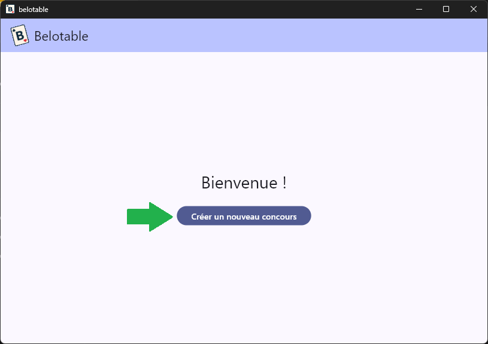
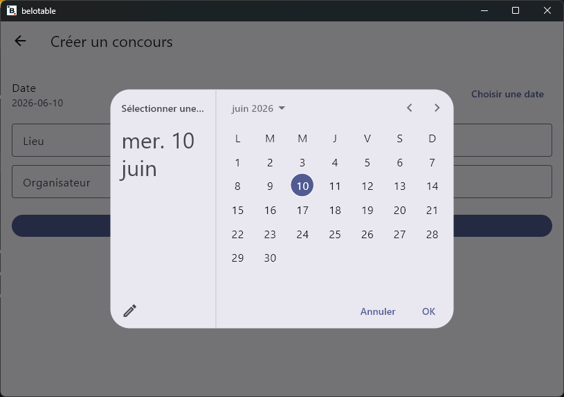
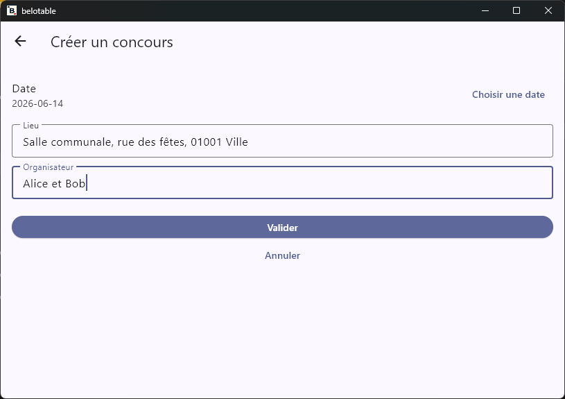
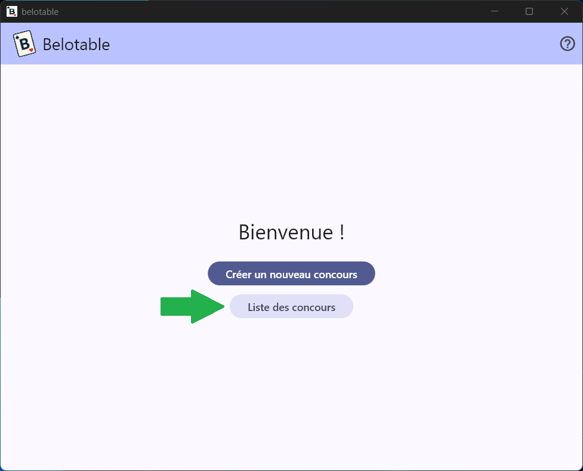
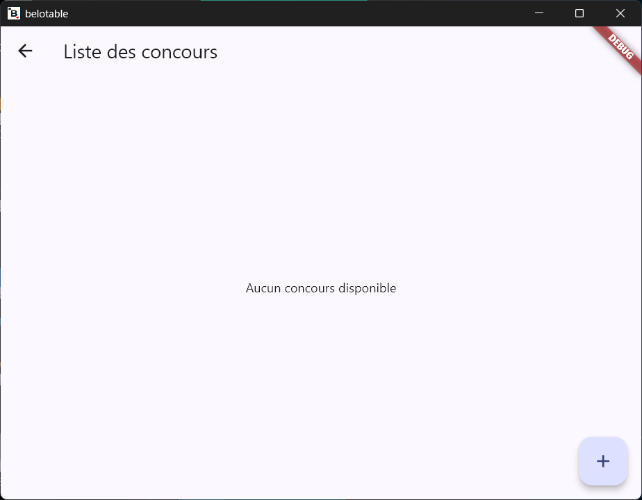
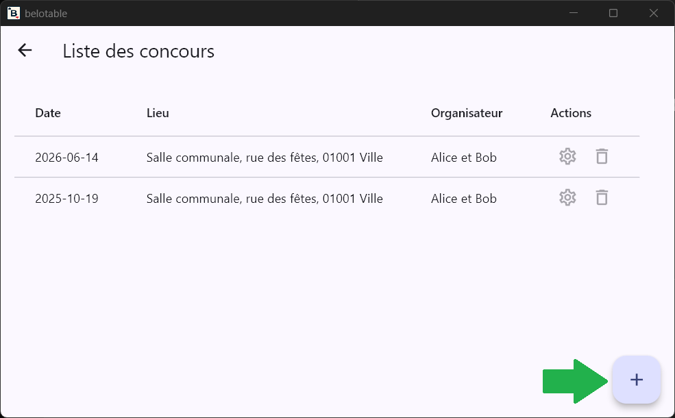
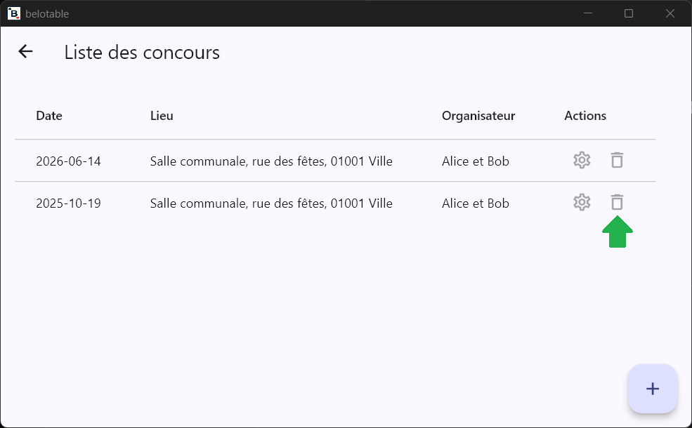
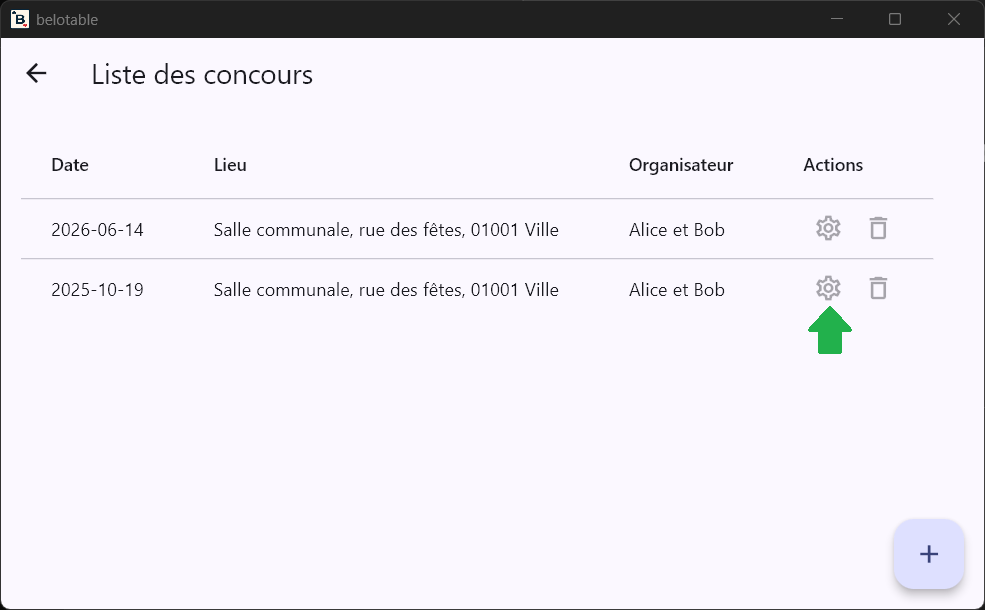
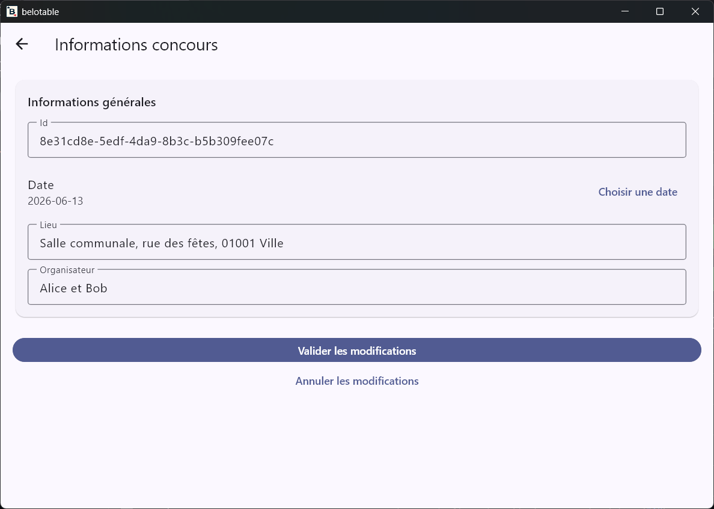

# Utilisation

## Page d'accueil

La page d'accueil est votre point d'entrée après le lancement de l'application.

## Création d'un concours

Depuis la page d'accueil, sélectionnez **Créer un nouveau concours**.

L'écran *Créer un concours* vous permet de renseigner les informations minimales du concours.

Les informations obligatoires sont :

- La **Date** du concours
- Le **Lieu** du concours (de préférence une adresse postale complète)
- L'**Organisateur** du concours (le nom de la personne ou de l'entité responsable)

La date du concours est initialisée à la date du jour, mais vous pouvez la modifier.

Valider la création du concours en sélectionnant **Valider**. Vous serez redirigé vers la page d'accueil avec le nouveau concours enregistré.

Annuler la création du concours en sélectionnant **Annuler**. Vous serez redirigé vers la page d'accueil sans enregistrer de nouveau concours.

## Liste des concours

Depuis la page d'accueil, sélectionnez **Liste des concours**.

La page *Liste des concours* affiche tous les concours enregistrés, triés du plus récent au plus ancien.

Chaque ligne affiche :

- La **Date** du concours
- Le **Lieu** du concours
- L'**Organisateur** du concours

Si aucun concours n'est disponible, le message **Aucun concours disponible** est affiché.

La page de liste propose un bouton **+** pour créer un nouveau concours. Ce bouton ouvre directement l'écran *Créer un concours*.

## Suppression d'un concours

Depuis la page de liste des concours, cliquez sur le bouton **Supprimer** associé au concours que vous souhaitez supprimer.

Une pop-up de confirmation de suppression s'affichera pour éviter les suppressions accidentelles.

## Gestion d'un concours

Après la création d'un concours, vous pouvez gérer les informations de ce concours depuis la page de liste des concours en cliquant sur le bouton **Gérer** associé au concours.

Vous pourrez alors consulter les informations du concours et les modifier.

